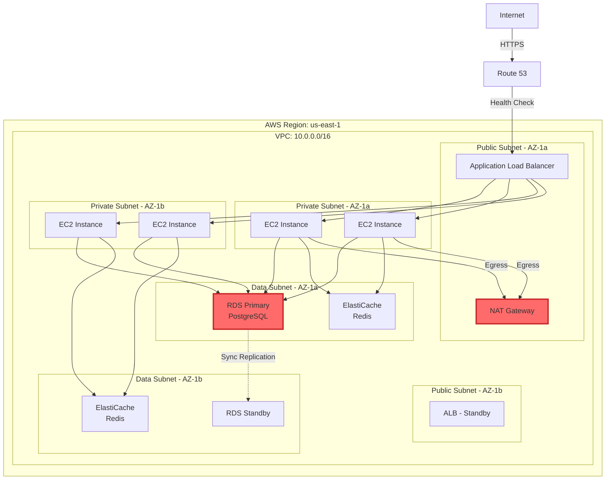
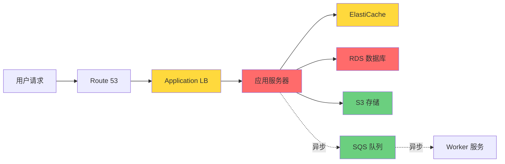
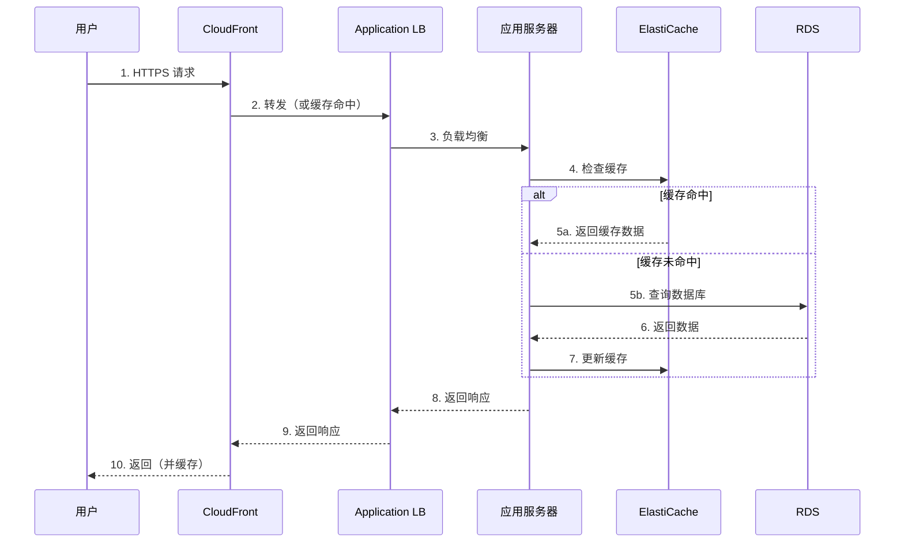
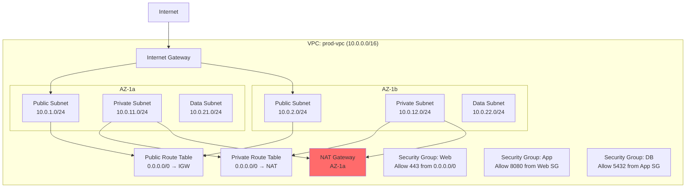
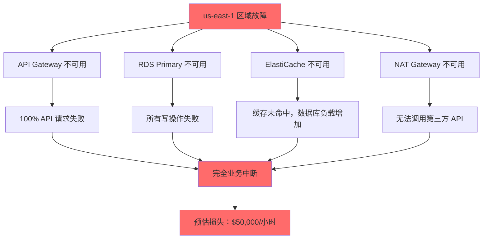

# AWS 系统韧性分析报告
## [客户名称] - [环境名称]

**分析日期**：2025-02-17
**分析师**：Claude (AWS Resilience Assessment Skill)
**版本**：1.0

---

## 执行摘要

### 概述
本报告对 [客户名称] 的 AWS 生产环境进行了全面的韧性评估，识别了潜在的故障模式，并提供了优先级排序的改进建议。

### 当前韧性成熟度

**总体评分**：⭐⭐⭐ (3/5 - 已定义)

| 维度 | 评分 | 说明 |
|------|------|------|
| 架构韧性 | ⭐⭐⭐⭐ | 多 AZ 部署，但缺少跨区域 DR |
| 数据韧性 | ⭐⭐⭐ | 定期备份，但未测试恢复 |
| 运营韧性 | ⭐⭐ | 基础监控，缺少自动化恢复 |
| 测试韧性 | ⭐⭐ | 年度 DR 演练，无混沌工程 |
| 合规韧性 | ⭐⭐⭐ | 定义 SLA，但无 SLO 跟踪 |

### 关键发现（Top 5 风险）

| 优先级 | 风险 | 影响 | 当前状态 |
|--------|------|------|---------|
| 🔴 高 | RDS 单区域部署 | RTO > 30 分钟 | 需迁移到 Aurora Global |
| 🔴 高 | 缺少 Auto Scaling | 无法应对流量突增 | 需配置 Target Tracking |
| 🟡 中 | 监控覆盖不足 | 故障检测延迟 | 需集成 X-Ray 和 Synthetics |
| 🟡 中 | 未实施 Circuit Breaker | 级联故障风险 | 需在应用层实现 |
| 🟢 低 | NAT Gateway 单 AZ | 单点故障 | 需多 AZ 部署 |

### 优先改进建议（Top 3）

1. **迁移到 Aurora Global Database**
   - **预期效果**：RTO < 1 分钟，RPO < 1 秒
   - **实施周期**：3-4 周
   - **预估成本**：+$500-2000/月

2. **实施 Auto Scaling 策略**
   - **预期效果**：自动应对 3x 流量突增
   - **实施周期**：1-2 周
   - **预估成本**：变动成本（按需）

3. **建立混沌工程实践**
   - **预期效果**：每季度验证韧性，提前发现问题
   - **实施周期**：持续
   - **预估成本**：$100-300/月

### 预期投资和回报

| 项目 | 一次性投资 | 月度成本 | 预期收益 |
|------|-----------|---------|---------|
| 基础韧性改进 | $10,000 | +$500 | 减少 70% 中断时间 |
| 完整韧性改进 | $30,000 | +$2,000 | 达到 99.99% 可用性 |
| 持续改进计划 | $5,000 | +$500 | 持续韧性验证 |

**ROI 分析**：
- 当前估计年度中断损失：$100,000
- 实施后预期减少：$70,000/年
- 投资回收期：6 个月

---

## 1. 系统架构可视化

### 1.1 当前架构总览



**🚨 识别的单点故障**：
- NAT Gateway（仅 AZ-1a）
- RDS Primary（故障转移需 60-120 秒）

### 1.2 组件依赖关系图



**依赖关系说明**：
- 🔴 关键依赖（同步）：RDS、应用服务器
- 🟡 重要依赖（同步）：ElastiCache、ALB
- 🟢 可选依赖（异步）：S3、SQS

### 1.3 数据流图



### 1.4 网络拓扑图



**网络分析**：
- ✅ 多 AZ 部署（1a、1b）
- ✅ 分层子网（Public、Private、Data）
- ✅ 安全组遵循最小权限原则
- 🚨 NAT Gateway 单 AZ（单点故障）
- ⚠️ 缺少 VPC Flow Logs（可观测性不足）

---

## 2. 故障模式识别与分类

### 2.1 单点故障 (SPOF)

| 风险 ID | 组件 | 故障场景 | 影响 | 概率 | 优先级 |
|---------|------|---------|------|------|--------|
| R-001 | NAT Gateway (AZ-1a) | AZ-1a 故障 | AZ-1b 实例无法访问互联网 | 中 (3) | 🟡 中 |
| R-002 | RDS Primary | 硬件故障 | 60-120s 故障转移延迟 | 低 (2) | 🟡 中 |
| R-003 | API Gateway (单区域) | 区域故障 | 完全服务中断 | 极低 (1) | 🔴 高 |

**详细分析：R-003 - API Gateway 单区域部署**

**当前配置**：
```yaml
Region: us-east-1
Endpoints:
  - API Gateway: https://api.example.com
  - 无跨区域复制
  - 无故障转移机制
```

**故障场景**：
- us-east-1 区域级故障（历史案例：2017 年 S3 中断）
- API Gateway 服务中断

**影响**：
- 所有 API 请求失败
- 100% 用户无法使用服务
- 业务完全中断

**当前缓解措施**：
- ❌ 无

**建议改进**：
参见 [6.1 缓解策略 - R-003](#61-r-003-多区域-api-部署)

### 2.2 过度延迟

| 风险 ID | 组件 | 瓶颈点 | 当前延迟 | 目标延迟 | 优先级 |
|---------|------|--------|---------|---------|--------|
| R-004 | 数据库查询 | N+1 查询 | P95: 500ms | < 200ms | 🔴 高 |
| R-005 | 跨 AZ 调用 | 网络往返 | P95: 5ms | < 2ms | 🟢 低 |

### 2.3 过度负载

| 风险 ID | 组件 | 容量限制 | 当前峰值 | 预期增长 | 优先级 |
|---------|------|---------|---------|---------|--------|
| R-006 | EC2 Auto Scaling | 固定容量（4 实例） | 80% CPU | 流量增长 50%/年 | 🔴 高 |
| R-007 | RDS 连接池 | 最大 100 连接 | 峰值 85 | 预计超限 | 🟡 中 |
| R-008 | API Gateway | 10,000 RPS 配额 | 峰值 8,500 | 季节性突增 | 🟡 中 |

### 2.4 错误配置

| 风险 ID | 配置项 | 问题 | Well-Architected 违反 | 优先级 |
|---------|--------|------|---------------------|--------|
| R-009 | RDS 备份 | 保留期 7 天 | 推荐 30 天 | 🟢 低 |
| R-010 | CloudWatch 日志 | 未设置保留期 | 成本优化 | 🟢 低 |
| R-011 | IAM 策略 | 过于宽松（s3:*） | 安全 | 🟡 中 |
| R-012 | 未启用 MFA Delete | S3 数据误删风险 | 可靠性 | 🟡 中 |

### 2.5 共享命运 (Shared Fate)

| 风险 ID | 共享资源 | 耦合组件 | 影响范围 | 优先级 |
|---------|---------|---------|---------|--------|
| R-013 | RDS Primary | 所有应用服务 | 数据库故障影响 100% | 🔴 高 |
| R-014 | 单个 AWS 账户 | 所有环境 | 账户级配额、安全 | 🟡 中 |
| R-015 | NAT Gateway | AZ-1b 出站流量 | 50% 实例无互联网 | 🟡 中 |

---

## 3. 韧性评估（5 星评分）

### 3.1 RDS 数据库

| 评估维度 | 评分 | 当前状态 | 差距分析 | 改进建议 |
|---------|------|---------|---------|---------|
| **冗余设计** | ⭐⭐⭐ | Multi-AZ 部署 | 单区域，区域故障 RTO > 30 分钟 | 迁移到 Aurora Global Database |
| **AZ 容错** | ⭐⭐⭐⭐ | 自动故障转移 | RTO 60-120 秒 | 使用 Aurora（RTO < 30s） |
| **超时与重试** | ⭐⭐⭐ | 应用层配置 5s 超时 | 未配置指数退避 | 实施指数退避重试 |
| **断路器** | ⭐ | 无 | 数据库故障导致应用崩溃 | 实施 Circuit Breaker |
| **自动扩展** | ⭐⭐ | 手动扩展 | 响应慢，需人工干预 | 启用 Auto Scaling（Aurora） |
| **配置防护** | ⭐⭐⭐ | IaC (Terraform) | 未启用 drift 检测 | AWS Config 规则 |
| **故障隔离** | ⭐⭐ | 所有服务共享 | 无读写分离 | 实施读副本 |
| **备份恢复** | ⭐⭐⭐ | 每日自动备份 | 未测试恢复 | 季度恢复演练 |
| **最佳实践** | ⭐⭐⭐ | 部分合规 | 未加密（静态） | 启用加密 |

**综合评分**：⭐⭐⭐ (3/5)

### 3.2 应用服务器 (EC2 / ECS)

| 评估维度 | 评分 | 当前状态 | 差距分析 | 改进建议 |
|---------|------|---------|---------|---------|
| **冗余设计** | ⭐⭐⭐⭐ | 多 AZ 部署 | 配置正确 | 保持 |
| **AZ 容错** | ⭐⭐⭐⭐ | Auto Scaling 跨 AZ | 健康检查配置正确 | 增加预热实例 |
| **超时与重试** | ⭐⭐ | 部分配置 | 依赖服务无超时 | 所有外部调用配置超时 |
| **断路器** | ⭐ | 无 | 依赖故障导致级联 | 集成 resilience4j |
| **自动扩展** | ⭐⭐ | 固定容量（4 实例） | 无法应对突增 | Target Tracking Auto Scaling |
| **配置防护** | ⭐⭐⭐⭐ | CI/CD + IaC | 配置审查流程 | 保持 |
| **故障隔离** | ⭐⭐⭐ | 微服务架构 | 部分服务紧耦合 | 解耦共享依赖 |
| **备份恢复** | ⭐⭐⭐⭐⭐ | AMI + 自动化部署 | 配置完善 | 保持 |
| **最佳实践** | ⭐⭐⭐⭐ | 大部分合规 | 少量优化空间 | 详见具体建议 |

**综合评分**：⭐⭐⭐ (3.2/5)

### 3.3 汇总评分

```
总体韧性评分：⭐⭐⭐ (3/5 - 已定义)

成熟度模型：
├─ Level 1: 初始（被动响应）
├─ Level 2: 可重复（有记录流程）
├─ Level 3: 已定义（标准化流程）✅ 当前
├─ Level 4: 管理（量化管理）    ← 目标
└─ Level 5: 优化（持续改进）
```

---

## 4. 业务影响分析

### 4.1 关键业务功能映射

| 业务功能 | 依赖组件 | 优先级 | 当前 RTO | 当前 RPO | 目标 RTO | 目标 RPO |
|---------|---------|--------|---------|---------|---------|---------|
| 用户登录/注册 | ALB + App + RDS | P0 | 2 分钟 | 5 分钟 | 1 分钟 | 1 分钟 |
| 订单处理 | ALB + App + RDS + SQS | P0 | 5 分钟 | 5 分钟 | 2 分钟 | 0 秒 |
| 支付交易 | 第三方 API + App + RDS | P0 | 5 分钟 | 0 秒 | 1 分钟 | 0 秒 |
| 库存查询 | ALB + App + Cache + RDS | P1 | 10 分钟 | N/A | 5 分钟 | N/A |
| 报表生成 | Worker + RDS | P2 | 1 小时 | 1 小时 | 30 分钟 | 30 分钟 |

### 4.2 组件故障影响矩阵

| 组件 | 故障场景 | 影响的业务功能 | 影响程度 | 用户影响 | 当前 RTO |
|------|---------|---------------|---------|---------|---------|
| **RDS Primary** | AZ 故障 | 所有写操作 | 严重 | 100% 无法下单 | 2 分钟 |
| **ALB** | 配置错误 | 所有流量 | 严重 | 100% 无法访问 | 10 分钟 |
| **ElastiCache** | 节点故障 | 用户会话、缓存 | 中等 | 需重新登录，查询变慢 | 即时（降级） |
| **NAT Gateway** | AZ-1a 故障 | AZ-1b 出站流量 | 中等 | 50% 实例无法调用第三方 API | 15 分钟 |
| **SQS 队列** | 队列延迟 | 异步任务处理 | 轻微 | 报表延迟 | 不影响实时 |

### 4.3 RTO/RPO 合规性分析

**当前架构 vs 业务目标**：

```
业务功能：订单处理
├─ 业务目标：RTO < 2 分钟，RPO = 0 秒
├─ 当前能力：RTO ~ 5 分钟，RPO ~ 5 分钟
└─ 差距：❌ 不符合

原因分析：
1. RDS Multi-AZ 故障转移需要 60-120 秒
2. 应用重连数据库需要 30-60 秒
3. 健康检查检测延迟 30 秒
4. RPO 取决于 RDS 备份频率（5 分钟）

改进建议：
1. 迁移到 Aurora（故障转移 < 30 秒）
2. 应用实现快速重连（连接池）
3. 减少健康检查间隔（15 秒）
4. 启用 Aurora Backtrack（RPO = 0）
```

**合规性总结**：

| 业务功能 | 目标 RTO | 当前 RTO | 合规性 | 差距 |
|---------|---------|---------|--------|------|
| 用户登录 | 1 分钟 | 2 分钟 | ❌ | -1 分钟 |
| 订单处理 | 2 分钟 | 5 分钟 | ❌ | -3 分钟 |
| 支付交易 | 1 分钟 | 5 分钟 | ❌ | -4 分钟 |
| 库存查询 | 5 分钟 | 10 分钟 | ❌ | -5 分钟 |
| 报表生成 | 30 分钟 | 1 小时 | ❌ | -30 分钟 |

**结论**：当前架构无法满足任何业务功能的 RTO/RPO 目标，需要紧急改进。

---

## 5. 风险优先级排序

### 5.1 风险评分矩阵

**评分公式**：

```
风险得分 = (发生概率 × 业务影响 × 检测难度) / 修复复杂度

其中：
- 发生概率：1-5（1=极低，5=极高）
- 业务影响：1-5（1=轻微，5=严重）
- 检测难度：1-5（1=易检测，5=难检测）
- 修复复杂度：1-5（1=简单，5=复杂）
```

### 5.2 风险清单（按优先级排序）

| 排名 | 风险 ID | 风险描述 | 概率 | 影响 | 检测 | 修复 | 得分 | 优先级 |
|------|---------|---------|------|------|------|------|------|--------|
| 1 | R-013 | RDS 单区域部署 | 2 | 5 | 2 | 3 | 6.67 | 🔴 高 |
| 2 | R-006 | 缺少 Auto Scaling | 4 | 4 | 1 | 2 | 8.00 | 🔴 高 |
| 3 | R-004 | 数据库 N+1 查询 | 5 | 3 | 2 | 2 | 15.00 | 🔴 高 |
| 4 | R-003 | API 单区域部署 | 1 | 5 | 2 | 4 | 2.50 | 🟡 中 |
| 5 | R-007 | RDS 连接池限制 | 3 | 4 | 2 | 1 | 24.00 | 🟡 中 |
| 6 | R-001 | NAT Gateway 单 AZ | 3 | 3 | 1 | 1 | 9.00 | 🟡 中 |
| 7 | R-014 | 单账户架构 | 2 | 3 | 3 | 5 | 3.60 | 🟢 低 |
| 8 | R-009 | RDS 备份保留期短 | 2 | 2 | 1 | 1 | 4.00 | 🟢 低 |

### 5.3 风险可视化矩阵

```
影响 ↑
5 │     [R-013]           [R-003]
4 │  [R-006] [R-007]
3 │        [R-004]    [R-001]
  │                   [R-014]
2 │ [R-009]
1 │
  └─────────────────────────────→ 概率
    1    2    3    4    5

图例：
🔴 高优先级（风险得分 > 5）
🟡 中优先级（风险得分 2-5）
🟢 低优先级（风险得分 < 2）
```

### 5.4 级联效应分析

**场景：us-east-1 区域故障**



**结论**：
- 单区域架构存在严重的级联故障风险
- 区域故障导致完全业务中断
- 建议：实施多区域 DR 策略（至少导航灯模式）

---

（报告后续部分包括：缓解策略建议、实施路线图、持续改进计划、附录等，格式类似）

---

## 说明

这是一个**示例模板**，展示了最终报告的格式和内容。实际分析时会根据你的具体环境和需求进行定制。

报告的其他部分（6-9 节）将包含：
- 详细的缓解策略（含架构图、代码、命令）
- 分阶段实施路线图（Gantt 图、资源需求）
- 持续改进计划（SLO/SLI、事后复盘、混沌工程）
- 附录（完整资源清单、配置审计、术语表）

完整报告通常为 30-50 页，包含大量可视化图表和可执行的代码示例。
