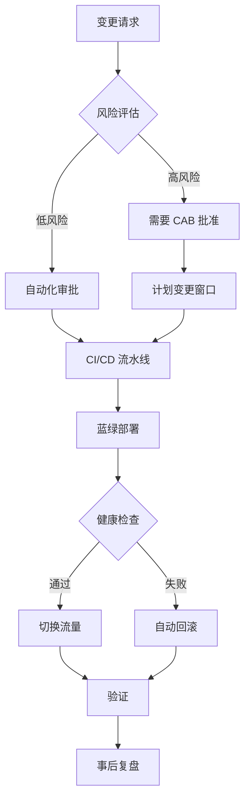
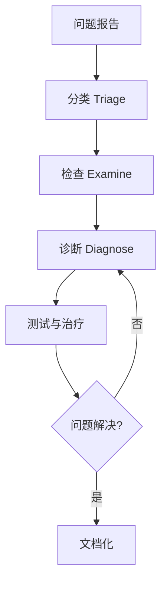

# AWS Resilience Analysis Framework 详细参考

本文档基于 2025 年最新的系统韧性领域知识，整合了 AWS Well-Architected Framework、AWS 韧性分析框架和混沌工程的最佳实践。

## 1. AWS Well-Architected Framework - 可靠性支柱 (2025)

### 1.1 五大设计原则

#### 原则 1：自动从故障中恢复 (Automatically Recover from Failure)

**核心理念**：
- 通过监控关键性能指标 (KPIs) 实现自动化故障检测和恢复
- KPIs 应衡量业务价值而非技术细节
- 启用自动通知、追踪和恢复流程
- 使用预测性自动化提前修复故障

**实施要点**：
```yaml
监控策略:
  业务指标:
    - 订单完成率
    - 用户登录成功率
    - 交易处理时间

  技术指标:
    - CPU/内存利用率
    - 网络吞吐量
    - 错误率

自动恢复:
  - Auto Scaling Groups (自动替换故障实例)
  - RDS Multi-AZ (自动故障转移)
  - Route 53 Health Checks (DNS 故障转移)
  - Lambda Dead Letter Queues (失败重试)
```

#### 原则 2：测试恢复流程 (Test Recovery Procedures)

**核心理念**：
- 在云环境中主动验证恢复策略
- 使用自动化模拟各种故障场景
- 重现历史故障场景
- 在真实故障发生前发现并修复问题路径

**实施工具**：
- AWS Fault Injection Simulator (FIS)
- GameDays / Disaster Recovery Drills

**测试频率**：
- 混沌实验：每周（Staging）
- DR 切换演练：每月（部分流量）
- 完整 DR 演练：每季度（生产环境）
- 桌面演练：每月（理论场景）

#### 原则 3：水平扩展 (Scale Horizontally)

**核心理念**：
- 使用多个小资源替代单个大资源
- 降低单点故障影响
- 跨多个小资源分发请求
- 避免共享单点故障

**架构模式**：
```
反模式（垂直扩展）:
┌─────────────────┐
│  单个大型 EC2   │  ← 单点故障
│  (m5.24xlarge)  │
└─────────────────┘

最佳实践（水平扩展）:
┌──────┐ ┌──────┐ ┌──────┐ ┌──────┐
│ EC2  │ │ EC2  │ │ EC2  │ │ EC2  │  ← 冗余和容错
│(m5.xl)│(m5.xl)│(m5.xl)│(m5.xl)│
└──────┘ └──────┘ └──────┘ └──────┘
```

#### 原则 4：停止猜测容量 (Stop Guessing Capacity)

**核心理念**：
- 基于监控自动调整资源
- 监控需求和利用率
- 自动添加或移除资源
- 维持最优利用率
- 管理服务配额和约束

**AWS 服务**：
- AWS Auto Scaling（EC2、ECS、DynamoDB）
- Application Auto Scaling
- Predictive Scaling（基于 ML 预测）
- Service Quotas（配额管理）

#### 原则 5：通过自动化管理变更 (Manage Change Through Automation)

**核心理念**：
- 所有基础设施变更通过自动化进行
- 使用基础设施即代码 (IaC)
- 可追踪和审查的变更过程
- 减少人为错误

**实施工具**：
```yaml
IaC 工具:
  - AWS CloudFormation
  - Terraform
  - AWS CDK (TypeScript/Python)
  - Pulumi

CI/CD 工具:
  - AWS CodePipeline
  - GitHub Actions
  - GitLab CI
  - Jenkins

GitOps:
  - ArgoCD
  - Flux CD
```

### 1.2 灾难恢复策略

AWS 提供四种主要灾难恢复策略，按成本和复杂度递增：

| 策略 | RTO | RPO | 成本 | 复杂度 | 适用场景 |
|------|-----|-----|------|--------|---------|
| **备份与恢复** | 小时-天 | 小时-天 | $ | 低 | 数据丢失或损坏场景 |
| **导航灯 (Pilot Light)** | 10分钟-小时 | 分钟 | $$ | 中 | 区域灾难 |
| **温备份 (Warm Standby)** | 分钟 | 秒-分钟 | $$$ | 中-高 | 关键业务系统 |
| **多站点主动-主动** | 秒-分钟 | 秒 | $$$$ | 高 | 任务关键系统 |

#### 策略 1：备份与恢复 (Backup and Restore)

**架构**：
```
┌─────────────────────────────────────────────────┐
│ 主区域 (us-east-1)                              │
│  ┌──────────┐      定期备份     ┌────────────┐ │
│  │ RDS/EBS  │ ──────────────────>│ S3 Backups │ │
│  └──────────┘                    └────────────┘ │
└─────────────────────────────────────────────────┘
                       │ 跨区域复制
                       ▼
┌─────────────────────────────────────────────────┐
│ DR 区域 (us-west-2)                             │
│                    ┌────────────┐               │
│                    │ S3 Backups │               │
│                    └────────────┘               │
│                         │ 灾难时恢复             │
│                         ▼                        │
│                    ┌──────────┐                 │
│                    │ RDS/EBS  │                 │
│                    └──────────┘                 │
└─────────────────────────────────────────────────┘
```

**实施要点**：
- 使用 AWS Backup 集中管理
- 跨区域复制 (S3 CRR)
- 必须使用 IaC 部署 (CloudFormation/CDK)
- 定期测试恢复流程

**AWS 服务**：
- AWS Backup
- S3 Cross-Region Replication
- CloudFormation StackSets
- AWS Backup Vault Lock (合规)

#### 策略 2：导航灯 (Pilot Light)

**架构**：
```
主区域 (us-east-1) - 完整运行
┌─────────────────────────────────────┐
│ ┌─────┐  ┌─────┐  ┌─────┐          │
│ │ EC2 │  │ EC2 │  │ EC2 │  ← 运行  │
│ └─────┘  └─────┘  └─────┘          │
│      │       │       │              │
│      └───────┴───────┘              │
│              │                      │
│      ┌───────────────┐              │
│      │ RDS Primary   │  ← 运行     │
│      └───────────────┘              │
└─────────────────────────────────────┘
            │ 数据复制
            ▼
DR 区域 (us-west-2) - 核心始终在线
┌─────────────────────────────────────┐
│ ┌─────┐  ┌─────┐                   │
│ │ EC2 │  │ EC2 │  ← 已配置但关闭   │
│ └─────┘  └─────┘                   │
│                                     │
│      ┌───────────────┐              │
│      │ RDS Replica   │  ← 运行     │
│      └───────────────┘              │
└─────────────────────────────────────┘
```

**核心特点**：
- 核心基础设施始终在线（数据库、存储）
- 应用服务器已配置但关闭
- 故障时快速启动应用层（10-30 分钟）
- 数据持续复制，RPO 低

**AWS 服务**：
- Aurora Global Database
- DynamoDB Global Tables
- S3 Cross-Region Replication
- AMIs + Launch Templates

#### 策略 3：温备份 (Warm Standby)

**架构**：
```
主区域 (us-east-1) - 完整容量
┌─────────────────────────────────────┐
│ Route 53 (100% 流量)                │
│         │                            │
│    ┌────▼─────┐                     │
│    │   ALB    │                     │
│    └────┬─────┘                     │
│ ┌───────┴────────┐                 │
│ │ ASG (10 实例)  │  ← 完整容量     │
│ └────────────────┘                 │
│         │                            │
│    ┌────▼──────┐                    │
│    │ Aurora DB │                    │
│    └───────────┘                    │
└─────────────────────────────────────┘
            │ 持续复制
            ▼
DR 区域 (us-west-2) - 缩小规模运行
┌─────────────────────────────────────┐
│ Route 53 (0% 流量，健康检查待命)   │
│         │                            │
│    ┌────▼─────┐                     │
│    │   ALB    │                     │
│    └────┬─────┘                     │
│ ┌───────┴────────┐                 │
│ │ ASG (2 实例)   │  ← 25% 容量     │
│ └────────────────┘                 │
│         │                            │
│    ┌────▼──────┐                    │
│    │ Aurora DB │                    │
│    └───────────┘                    │
└─────────────────────────────────────┘
```

**核心特点**：
- DR 区域拥有缩小规模的完整环境（通常 25-50%）
- 无需启动即可处理请求
- 故障时仅需扩展容量（5-10 分钟）
- 持续数据同步，RPO 非常低

**故障转移流程**：
1. Route 53 检测主区域故障（健康检查失败）
2. 自动将 DNS 流量路由到 DR 区域
3. DR 区域 Auto Scaling 自动扩展到完整容量
4. 无数据丢失（持续复制）

#### 策略 4：多站点主动-主动 (Multi-Site Active-Active)

**架构**：
```
┌────────────────────────────────────────────────┐
│ Global Accelerator / CloudFront                │
│  (智能流量路由：延迟最低 + 健康检查)           │
└────────────────────────────────────────────────┘
         │                          │
    50% 流量                    50% 流量
         │                          │
    ┌────▼─────────────┐    ┌──────▼──────────┐
    │ us-east-1        │    │ us-west-2       │
    │ (完整容量)        │    │ (完整容量)       │
    │                  │    │                 │
    │ ┌──────────────┐ │    │ ┌─────────────┐│
    │ │ ASG (10实例) │ │    │ │ ASG (10实例)││
    │ └──────┬───────┘ │    │ └──────┬──────┘│
    │        │          │    │        │       │
    │ ┌──────▼────────┐│    │ ┌──────▼──────┐│
    │ │ Aurora Global ││◄───┼─┤Aurora Global││
    │ │ (Writer)      ││双向││ │(Read Replica││
    │ └───────────────┘│同步││ │可晋升为Writer│
    └───────────────────┘    └─────────────────┘
```

**核心特点**：
- 所有区域同时处理流量（无"主"概念）
- 使用 Route 53 或 Global Accelerator 智能路由
- DynamoDB Global Tables / Aurora Global Database
- RTO < 1 分钟，RPO < 1 秒
- 成本最高（2x 或更多）

**AWS 服务**：
- AWS Global Accelerator
- Route 53 with Latency-based Routing
- Aurora Global Database
- DynamoDB Global Tables
- CloudFront

### 1.3 故障隔离与多位置部署

#### 多可用区 (Multi-AZ) 架构

**物理隔离特性**：
- 独立电力供应
- 独立网络连接
- 物理距离：数公里到数十公里
- 低延迟：个位数毫秒 (< 2ms)
- 支持同步复制

**实施方式**：
```yaml
计算层:
  Auto Scaling:
    - 跨至少 3 个 AZ 部署
    - 使用 AZ Rebalancing
    - 健康检查：ELB + EC2

  ECS/EKS:
    - 任务/Pod 跨 AZ 分布
    - Service Mesh 故障转移

负载均衡:
  ALB/NLB:
    - 至少 2 个 AZ
    - Cross-Zone Load Balancing 启用
    - 健康检查配置

数据层:
  RDS Multi-AZ:
    - 同步复制
    - 自动故障转移 (60-120 秒)

  Aurora:
    - 6 副本跨 3 AZ
    - 自愈存储
    - 故障转移 < 30 秒
```

#### 多区域 (Multi-Region) 架构

**适用场景**：
- 关键基础设施（金融、医疗）
- 严格 SLA 要求（99.99%+）
- 全球用户低延迟
- 合规要求（数据驻留）

**关键组件**：

| 需求 | AWS 服务 | 说明 |
|------|---------|------|
| 基础设施复制 | CloudFormation StackSets | 跨区域部署相同基础设施 |
| 数据复制 | DynamoDB Global Tables | 多主复制，< 1s 延迟 |
| | Aurora Global Database | 跨区域复制，< 1s 延迟 |
| | S3 Cross-Region Replication | 对象存储复制 |
| 流量路由 | Route 53 | 健康检查 + 故障转移 |
| | Global Accelerator | Anycast IP + 自动故障转移 |
| | CloudFront | CDN + Origin Failover |
| DR 编排 | AWS Resilience Hub | 自动评估和改进建议 |
| | Application Recovery Controller | 跨区域流量控制 |

**实施示例（Active-Passive）**：

```yaml
# CloudFormation StackSet 参数
Regions:
  Primary: us-east-1
  Secondary: us-west-2

Deployment:
  Primary:
    Capacity: 100%
    TrafficWeight: 100%

  Secondary:
    Capacity: 25%
    TrafficWeight: 0%  # 待命

Failover:
  Trigger: Route 53 Health Check Failure
  Actions:
    - Update Route 53 DNS (60s TTL)
    - Scale Secondary to 100%
    - Promote Aurora Read Replica to Writer
  ExpectedRTO: 5 minutes
```

### 1.4 变更管理

**三大最佳实践领域**：

#### 1. 监控工作负载资源

**关键监控指标**：

| 信号 | 描述 | CloudWatch 指标 | 告警阈值 |
|------|------|----------------|---------|
| **延迟** | 请求响应时间 | TargetResponseTime | P95 > 200ms |
| **流量** | 系统需求 | RequestCount | 突增 > 200% |
| **错误** | 失败请求率 | HTTPCode_5XX_Count | > 1% |
| **饱和度** | 资源利用率 | CPUUtilization | > 80% |

**实施**：
```yaml
CloudWatch 仪表板:
  - 黄金信号概览
  - 按服务分组
  - 实时和历史趋势
  - 关联日志和追踪

CloudWatch Alarms:
  - 复合告警（多指标）
  - 异常检测（ML 驱动）
  - 多窗口告警（避免抖动）

X-Ray:
  - 分布式追踪
  - 服务地图
  - 延迟分析
```

#### 2. 设计自适应工作负载

**弹性模式**：

```yaml
Auto Scaling 策略:
  Target Tracking:
    - CPU 利用率目标：70%
    - ALB 请求计数：1000/实例
    - 自定义指标（队列深度）

  Step Scaling:
    - 快速响应突发流量
    - 阶梯式扩展

  Scheduled Scaling:
    - 已知高峰时段
    - 提前扩容

  Predictive Scaling:
    - ML 预测未来负载
    - 提前扩容

负载均衡:
  - ALB：HTTP/HTTPS 应用
  - NLB：TCP/UDP，极低延迟
  - GWLB：安全设备集成
  - Connection Draining：优雅停止
```

#### 3. 实施变更

**结构化变更管理流程**：



**应急措施（REL05-BP07）**：

```yaml
回滚计划:
  自动回滚触发器:
    - 错误率 > 1%
    - 延迟 P95 > 2x 基线
    - 健康检查失败 > 20%

  回滚方法:
    - 蓝绿部署：切换流量到旧版本
    - 金丝雀：停止推出，回退
    - CloudFormation：StackSet 回滚

  回滚时间目标: < 5 分钟

熔断机制:
  - 每次变更影响 < 10% 流量
  - 分阶段推出（1% → 10% → 50% → 100%）
  - 每阶段验证期：30 分钟
  - 任何阶段失败自动停止
```

---

## 2. AWS 韧性分析核心原则

### 2.1 错误预算 (Error Budget)

**核心哲学**：
> "拒绝追求 100% 可靠性。平衡不可用风险与创新速度和运营效率"

**计算公式**：

```
Error Budget = (1 - SLO) × 时间周期

示例：
SLO = 99.9%（月度）
Error Budget = (1 - 0.999) × 30 天 × 24 小时 × 60 分钟
             = 0.001 × 43,200 分钟
             = 43.2 分钟/月
```

**错误预算政策**：

| 错误预算状态 | 剩余 | 行动 |
|------------|------|------|
| 🟢 健康 | > 50% | 加速功能发布，进行混沌实验 |
| 🟡 警告 | 20-50% | 减缓发布节奏，增加测试 |
| 🔴 耗尽 | < 20% | 冻结功能发布，专注可靠性 |
| ⛔ 超支 | < 0% | 完全冻结，事后复盘，强制可靠性改进 |

**战略优势**：
- 协调产品开发（速度）和 SRE（可靠性）激励
- 通过客观测量消除发布决策政治化
- 预算耗尽时团队自我管控
- 在预算内合法化冒险

### 2.2 SLI/SLO/SLA

**定义**：

```yaml
SLI (Service Level Indicator):
  定义: 服务性能的定量测量
  格式: 成功事件数 / 总事件数 (0-100%)
  示例:
    - 延迟 < 100ms 的请求百分比
    - HTTP 200 响应的请求百分比
    - 可用性（正常运行时间百分比）

SLO (Service Level Objective):
  定义: 目标可靠性水平
  示例:
    - 99.9% 的请求在 100ms 内完成
    - 99.99% 的请求返回成功（非 5xx）
  用途: 内部目标设定，错误预算计算

SLA (Service Level Agreement):
  定义: 与客户的合同协议
  示例:
    - 月度可用性 99.9%，否则退款 10%
  特点:
    - 违反有财务后果
    - 通常低于 SLO（留有缓冲）
    - 法律合同，需谨慎承诺
```

**关系**：

```
SLA (对外承诺)    99.9%  ◄─ 客户合同
                   │
                   │ 缓冲（避免违约）
                   ▼
SLO (内部目标)    99.95% ◄─ 内部工程目标
                   │
                   │ 错误预算
                   ▼
SLI (实际测量)    99.97% ◄─ 实时监控
```

**SLI 选择指南**：

| 服务类型 | 推荐 SLI | 不推荐 SLI |
|---------|---------|-----------|
| **请求驱动** | 可用性、延迟、吞吐量 | CPU、内存（内部指标）|
| **存储** | 持久性、可用性、延迟 | 磁盘利用率 |
| **批处理** | 吞吐量、端到端延迟 | 任务队列长度 |
| **流处理** | 新鲜度、正确性 | Kafka lag（中间指标）|

### 2.3 四大黄金信号

| 信号 | 描述 | 测量方式 | 告警阈值 |
|------|------|---------|---------|
| **延迟 (Latency)** | 请求响应时间 | P50, P95, P99 延迟 | P95 > 2x 基线 |
| **流量 (Traffic)** | 系统需求 | 请求/秒、会话数 | 突增 > 3x 基线 |
| **错误 (Errors)** | 失败请求率 | 5xx 错误 / 总请求 | > 1% |
| **饱和度 (Saturation)** | 资源利用率 | CPU、内存、磁盘、网络 | > 80% |

**重要区分**：
- **成功请求延迟 vs 失败请求延迟**：失败通常更快（快速失败），但也可能超时
- **显式错误 vs 隐式错误 vs 策略性错误**：
  - 显式：HTTP 500
  - 隐式：HTTP 200 但内容错误
  - 策略性：限流（HTTP 429）

### 2.4 监控方法

**白盒监控 vs 黑盒监控**：

| 特性 | 白盒监控 | 黑盒监控 |
|------|---------|---------|
| **数据源** | 内部指标、日志、性能分析 | 外部探针、用户模拟 |
| **检测时机** | 早期（预测故障） | 活跃故障时 |
| **覆盖范围** | 全面（包括隐藏问题） | 用户可见问题 |
| **告警频率** | 高（预警） | 低（实际影响） |
| **示例** | CPU 接近饱和 | 健康检查失败 |

**推荐策略**：
- 大量白盒监控（预测和诊断）
- 关键黑盒监控（用户影响验证）
- 白盒检测 → 黑盒验证

**实施**：
```yaml
白盒监控:
  CloudWatch:
    - CPU、内存、磁盘、网络
    - 应用指标（自定义）
    - 日志分析

  X-Ray:
    - 分布式追踪
    - 服务依赖图

  Container Insights:
    - ECS/EKS 容器指标

黑盒监控:
  Route 53 Health Checks:
    - HTTPS 端点检查
    - 多区域探针
    - 字符串匹配

  CloudWatch Synthetics:
    - Canary 脚本（用户旅程）
    - 定期执行
    - 截图和HAR文件

  第三方:
    - Pingdom
    - Datadog Synthetics
```

### 2.5 有效告警哲学

**有效告警标准**：
1. 检测到未被发现的紧急可操作条件
2. 表示实际用户影响
3. 需要智能响应（非机械修复）
4. 解决新问题

**原则**：
- 告警应足够稀有以维持紧迫性
- 频繁告警导致疲劳和错过关键告警
- "如果告警每周触发，就不应该是告警，应该是自动化修复或ticket"

**告警层级**：

| 优先级 | 描述 | 响应 SLA | 影响 | 示例 |
|--------|------|---------|------|------|
| **P0 (Critical)** | 影响所有用户 | 立即（15 分钟） | 完全中断 | 数据库不可用 |
| **P1 (High)** | 影响部分用户 | 1 小时 | 降级服务 | 单 AZ 故障 |
| **P2 (Medium)** | 影响内部或预警 | 当天 | 潜在问题 | 磁盘空间 < 30% |
| **P3 (Low)** | 信息性 | 正常工作时间 | 无直接影响 | 证书 30 天后过期 |

**告警疲劳避免**：
```yaml
策略:
  告警聚合:
    - 多个相关告警合并为一个
    - 避免"告警风暴"

  多窗口告警:
    - 短窗口（5 分钟）+ 长窗口（30 分钟）
    - 避免瞬时抖动

  告警抑制:
    - 维护窗口自动抑制
    - 依赖关系（数据库故障抑制应用告警）

  渐进升级:
    - 5 分钟：Slack 通知
    - 15 分钟：寻呼机告警
    - 30 分钟：升级到高级 SRE
```

### 2.6 事后复盘文化 (Postmortem Culture)

**核心原则：无责任文化 (Blameless)**

```yaml
无责任原则:
  - 专注于识别促成因素
  - 不指责个人或团队
  - 源自医疗和航空等高风险行业
  - 假设每个人都怀有良好意图

理念:
  "Human error is a symptom, not a cause"
  （人为错误是症状，而非原因）

  根本原因通常是：
  - 系统设计缺陷
  - 流程不足
  - 工具缺失
  - 培训不够
```

**事后复盘模板**：

```markdown
# 事故复盘：[标题]

## 元数据
- 日期：2025-02-17
- 严重程度：P1（高）
- 持续时间：45 分钟
- 影响：30% 用户无法登录
- 作者：[Name]
- 审查人：[Name]

## 执行摘要
（2-3 句话概述发生了什么、影响、根因、修复）

## 时间线
| 时间 | 事件 | 行动 |
|------|------|------|
| 10:00 | 检测到登录失败率上升 | 自动告警触发 |
| 10:05 | On-call 工程师收到告警 | 开始调查 |
| 10:15 | 识别为 RDS 连接池耗尽 | 决策增加连接池 |
| 10:30 | 增加连接池大小到 1000 | 执行配置变更 |
| 10:45 | 服务完全恢复 | 关闭事故 |

## 根本原因
RDS 连接数达到最大值（500），应用无法创建新连接。
促成因素：
1. 流量突增（比平时高 3 倍）
2. 应用代码存在连接泄漏
3. 连接池监控不足

## 影响
- 用户影响：30%（约 1000 用户）
- SLO 影响：违反 99.9% SLO，消耗 15 分钟错误预算
- 业务影响：估计损失 $5000 收入

## 检测
✅ 做得好：
- CloudWatch 告警按预期工作（5 分钟检测）
- On-call 及时响应

❌ 需改进：
- 未提前检测到连接泄漏
- 未监控连接池利用率

## 响应
✅ 做得好：
- 15 分钟内识别根因
- 沟通透明（状态页更新）
- 回滚计划执行顺利

❌ 需改进：
- 初期诊断方向错误（浪费 5 分钟）
- Runbook 不完整

## 恢复
- 恢复时间：45 分钟（目标：30 分钟）
- 恢复方法：增加连接池 + 重启应用
- 用户影响持续到完全恢复

## 行动项
| 优先级 | 行动 | 负责人 | 截止日期 | 状态 |
|--------|------|--------|---------|------|
| P0 | 添加连接池利用率告警 | @SRE-team | 2025-02-20 | ✅ 完成 |
| P0 | 修复应用连接泄漏 | @Dev-team | 2025-02-24 | 🔄 进行中 |
| P1 | 更新 Runbook（连接池故障） | @SRE-team | 2025-02-27 | ⏳ 待办 |
| P2 | 进行负载测试 | @QA-team | 2025-03-01 | ⏳ 待办 |
| P2 | 实施 Circuit Breaker | @Dev-team | 2025-03-15 | ⏳ 待办 |

## 经验教训
1. 连接池是有状态资源，需要特别监控
2. 流量突增需要 Auto Scaling + 资源配额预留
3. 应用必须优雅处理资源耗尽（快速失败）
4. Runbook 必须定期审查和更新

## 支持数据
（附加图表、日志片段、指标截图）
```

**最佳实践**：

```yaml
协作:
  - 实时协作工具（Wiki、文档协作平台）
  - 评论系统（所有人可以添加见解）
  - 跨团队参与（开发、运维、产品）

审查:
  "未经审查的事后复盘形同虚设"
  - 至少 2 名审查人（技术 + 管理）
  - 验证行动项的可操作性
  - 确保无责任原则

可见化:
  - 庆祝良好实践（表彰透明和诚实）
  - 领导层参与（显示重视）
  - 公开分享（内部知识库）
  - 月度复盘分享会

反馈:
  - 定期调查流程有效性
  - 跟踪行动项完成率
  - 测量类似事故重复率
```

**文化推广活动**：

```yaml
月度复盘分享:
  - 选择最有学习价值的复盘
  - 全公司午餐分享
  - Q&A 环节

读书俱乐部:
  - 讨论历史事件（航空事故、医疗事故）
  - 应用到技术系统
  - 识别系统性问题

灾难角色扮演 (Wheel of Misfortune):
  - 模拟真实事故场景
  - 轮换 On-call 角色
  - 练习事故响应流程
  - 识别 Runbook 差距
```

### 2.7 有效故障排查

**方法论：假设-演绎法**

**关键阶段**：



**1. 问题报告**

```yaml
必需信息:
  - 期望行为：应该发生什么？
  - 实际行为：实际发生了什么？
  - 复现方法：如何重现问题？
  - 影响范围：有多少用户受影响？
  - 开始时间：何时开始的？

来源:
  - 用户报告
  - 监控告警
  - 健康检查失败
```

**2. 分类 (Triage)**

```yaml
首要职责: "让飞机安全着陆"

优先级排序:
  1. 止血（停止出血）
     - 切换到备用系统
     - 限流保护核心服务
     - 回滚错误变更

  2. 恢复服务
     - 即使不知道根因
     - 临时解决方案 OK

  3. 根因分析
     - 服务恢复后再深入
     - 事后复盘详细调查

快速决策:
  - 5 分钟决定是否回滚
  - 15 分钟决定是否升级
```

**3. 检查 (Examine)**

```yaml
收集数据:
  时间序列指标:
    - CloudWatch Metrics
    - 对比故障前后
    - 识别异常模式

  日志:
    - CloudWatch Logs Insights
    - 错误日志、应用日志
    - 关联请求 ID

  追踪:
    - X-Ray Traces
    - 识别慢服务
    - 找到故障点

  当前状态:
    - 健康检查端点
    - AWS 服务健康仪表板
    - 资源利用率

工具:
  - CloudWatch Dashboards
  - X-Ray Service Map
  - CloudTrail（变更审计）
  - AWS Config（配置变更）
```

**4. 诊断 (Diagnose)**

**策略**：

| 策略 | 描述 | 何时使用 |
|------|------|---------|
| **简化和化简** | 逐步移除组件，识别问题所在 | 复杂系统 |
| **二分法** | 将系统分两半，确定问题在哪一半 | 长流程 |
| **追问"什么""哪里""为什么"** | 系统性询问 | 根因分析 |
| **查看最近变更** | 80% 故障源于变更 | 首要检查 |

**示例：二分法**

```
用户请求 → API Gateway → Lambda → DynamoDB → 返回
            ^                ^          ^
            |                |          |
       慢在这里?        慢在这里?    慢在这里?

测试 1: 直接调用 Lambda（绕过 API Gateway）
结果：仍然慢 → 问题不在 API Gateway

测试 2: Lambda 直接查询 DynamoDB
结果：快速 → 问题在 Lambda 业务逻辑

测试 3: 分析 Lambda 代码各部分
结果：发现 N+1 查询问题
```

**5. 测试与治疗**

```yaml
假设驱动:
  1. 形成假设
     示例："RDS 连接池耗尽导致超时"

  2. 设计测试
     - 检查 RDS 连接数指标
     - 查看应用连接池配置
     - 检查是否有连接泄漏

  3. 执行测试
     - 收集数据
     - 分析结果

  4. 验证或反驳
     - 假设正确 → 实施修复
     - 假设错误 → 新假设

文档化:
  - 记录每个假设
  - 记录测试方法
  - 记录结果
  - 记录推理过程
```

**常见陷阱**：

```yaml
关注无关症状:
  ❌ "CPU 高，所以慢"
  ✅ "慢的原因是什么？CPU 高是结果还是原因？"

过度依赖过去问题原因:
  ❌ "上次是数据库，这次肯定也是"
  ✅ "让数据引导，而非假设"

追逐虚假相关性:
  ❌ "部署后出问题，肯定是部署的问题"
  ✅ "时间相关性 ≠ 因果关系，需要证据"

忽视简单解释:
  ❌ 复杂的理论（网络分区、宇宙射线）
  ✅ 奥卡姆剃刀：最简单的解释通常是正确的
```

---

## 3. 混沌工程方法论

### 3.1 核心定义

> "混沌工程是通过在系统上进行实验来建立对系统能力的信心，使其能够承受生产环境中的动荡条件"
>
> —— Principles of Chaos Engineering

**目标**：
- 发现系统弱点在造成实际影响前
- 建立对系统韧性的信心
- 验证监控和告警是否有效
- 改进事故响应流程

### 3.2 四步实验流程

```yaml
步骤 1: 建立稳态基线
  定义:
    - "稳态"为可测量的系统输出
    - 表示正常行为

  示例:
    - 请求成功率: > 99.9%
    - P95 延迟: < 200ms
    - 吞吐量: 1000 req/s
    - 错误率: < 0.1%

步骤 2: 形成假设
  预测:
    - 稳态将在控制组和实验组中持续
    - 基于系统理解

  示例:
    "假设：终止 2 个 EC2 实例后，
     Auto Scaling 将在 5 分钟内恢复容量，
     用户体验影响 < 1%"

步骤 3: 引入变量
  模拟真实世界破坏:
    - 服务器崩溃
    - 网络故障
    - 磁盘满
    - 时钟偏移

  评估影响:
    - 观测稳态指标
    - 记录系统行为

步骤 4: 验证或反驳
  对比:
    - 控制组 vs 实验组
    - 识别稳态偏差

  结果:
    - 假设正确：系统韧性得到验证
    - 假设错误：发现弱点，改进系统
```

### 3.3 高级实施原则

| 原则 | 说明 | 实践 |
|------|------|------|
| **稳态关注** | 测量系统输出，而非内部机制 | 监控用户可见指标（延迟、错误） |
| **真实世界事件** | 变量应镜像实际运营中断 | 参考历史故障（EC2 故障、AZ 中断） |
| **生产测试** | "采样真实流量是唯一可靠方式" | 在生产环境中进行（受控） |
| **持续自动化** | 手动实验不可持续 | 自动化实现持续验证（每周/每月） |
| **控制爆炸半径** | 最小化客户影响 | 限制影响范围（单 AZ、10% 流量） |

### 3.4 常见混沌实验场景

#### AWS 环境常见场景：

| 实验类别 | 场景 | AWS FIS 操作 | 预期系统行为 |
|---------|------|-------------|-------------|
| **实例故障** | 终止 EC2 实例 | `aws:ec2:terminate-instances` | Auto Scaling 自动替换 |
| | 停止 EC2 实例 | `aws:ec2:stop-instances` | 健康检查失败，流量转移 |
| **网络故障** | 网络延迟 | `aws:ec2:api-network-latency` | 请求超时，重试机制触发 |
| | 网络丢包 | `aws:ec2:api-packet-loss` | 断路器打开，降级服务 |
| **AZ 故障** | 模拟 AZ 不可用 | 组合实验（终止所有 AZ 实例） | 流量转移到其他 AZ |
| **数据库** | RDS 故障转移 | `aws:rds:failover-db-cluster` | 应用自动重连，短暂中断 |
| **容器** | ECS 任务终止 | `aws:ecs:stop-task` | ECS 重启任务 |
| | EKS Pod 删除 | `aws:eks:pod-delete` | Deployment 重建 Pod |
| **资源耗尽** | CPU 压力 | `aws:ec2:cpu-stress` | Auto Scaling 扩容 |
| | 内存压力 | `aws:ec2:memory-stress` | OOM kill，容器重启 |
| | 磁盘满 | `aws:ec2:disk-fill` | 告警触发，清理流程启动 |

### 3.5 AWS FIS 实验模板示例

**实验 1：EC2 实例终止**

```json
{
  "description": "Terminate 30% of EC2 instances to test Auto Scaling",
  "targets": {
    "ec2-instances": {
      "resourceType": "aws:ec2:instance",
      "resourceTags": {
        "Environment": "production",
        "AutoScaling": "enabled"
      },
      "filters": [
        {
          "path": "State.Name",
          "values": ["running"]
        }
      ],
      "selectionMode": "PERCENT(30)"
    }
  },
  "actions": {
    "terminate-instances": {
      "actionId": "aws:ec2:terminate-instances",
      "parameters": {},
      "targets": {
        "Instances": "ec2-instances"
      }
    }
  },
  "stopConditions": [
    {
      "source": "aws:cloudwatch:alarm",
      "value": "arn:aws:cloudwatch:us-east-1:123456789012:alarm:high-error-rate"
    }
  ],
  "roleArn": "arn:aws:iam::123456789012:role/FISExperimentRole",
  "tags": {
    "Name": "EC2-Instance-Termination-Test"
  }
}
```

**实验 2：网络延迟注入**

```json
{
  "description": "Inject 200ms latency to 50% of API calls",
  "targets": {
    "api-gw-targets": {
      "resourceType": "aws:ec2:instance",
      "resourceTags": {
        "Service": "api-gateway"
      },
      "selectionMode": "PERCENT(50)"
    }
  },
  "actions": {
    "inject-latency": {
      "actionId": "aws:ec2:api-network-latency",
      "parameters": {
        "duration": "PT10M",
        "latencyMs": "200",
        "jitterMs": "50",
        "apiList": "ec2,rds,dynamodb"
      },
      "targets": {
        "Instances": "api-gw-targets"
      }
    }
  },
  "stopConditions": [
    {
      "source": "aws:cloudwatch:alarm",
      "value": "arn:aws:cloudwatch:us-east-1:123456789012:alarm:high-p95-latency"
    }
  ],
  "roleArn": "arn:aws:iam::123456789012:role/FISExperimentRole"
}
```

**实验 3：RDS 故障转移**

```json
{
  "description": "Test RDS Multi-AZ failover",
  "targets": {
    "rds-cluster": {
      "resourceType": "aws:rds:cluster",
      "resourceArns": [
        "arn:aws:rds:us-east-1:123456789012:cluster:production-db"
      ],
      "selectionMode": "ALL"
    }
  },
  "actions": {
    "failover-cluster": {
      "actionId": "aws:rds:failover-db-cluster",
      "parameters": {
        "targetInstance": "production-db-instance-2"
      },
      "targets": {
        "Clusters": "rds-cluster"
      }
    }
  },
  "stopConditions": [
    {
      "source": "none"
    }
  ],
  "roleArn": "arn:aws:iam::123456789012:role/FISExperimentRole",
  "tags": {
    "Name": "RDS-Failover-Test",
    "Frequency": "monthly"
  }
}
```

---

## 4. 现代可观测性标准

### 4.1 OpenTelemetry

**核心定义**：
> "旨在促进遥测数据（追踪、指标、日志）的生成、导出和收集的可观测性框架和工具包"

**关键原则**：
- **数据所有权**：用户完全控制遥测数据
- **统一学习曲线**：一套 API 和约定
- **供应商中立**：避免供应商锁定

**主要组件**：

```yaml
规范和协议:
  - OTLP (OpenTelemetry Protocol)
  - 统一的遥测数据格式

语言 SDK:
  - Java, Python, Go, .NET, JavaScript
  - Ruby, PHP, Rust, C++
  - 自动插桩 + 手动插桩

预构建插桩库:
  - HTTP 客户端/服务器
  - 数据库（MySQL, PostgreSQL, DynamoDB）
  - 消息队列（Kafka, SQS, SNS）
  - RPC 框架（gRPC）

OpenTelemetry Collector:
  - 接收遥测数据
  - 处理、过滤、转换
  - 导出到多个后端
  - 支持多种格式

Kubernetes 集成:
  - Operator
  - Helm Charts
  - 自动注入（Sidecar）
```

**架构**：

```
应用程序
    │
    │ OpenTelemetry SDK
    │ (插桩)
    ▼
OpenTelemetry Collector
    │
    │ 处理和路由
    │
    ├──────────┬──────────┬──────────┐
    ▼          ▼          ▼          ▼
CloudWatch  X-Ray   Prometheus  Jaeger
(指标)     (追踪)    (指标)     (追踪)
```

### 4.2 三大支柱

#### 1. 日志 (Logs)

**结构化日志最佳实践**：

```json
{
  "timestamp": "2025-02-17T10:00:00.123Z",
  "level": "ERROR",
  "service": "api-gateway",
  "trace_id": "1234567890abcdef",
  "span_id": "abcdef1234567890",
  "user_id": "user_123",
  "request_id": "req_xyz",
  "message": "Failed to connect to database",
  "error": {
    "type": "DatabaseConnectionError",
    "message": "Connection timeout after 30s",
    "stack_trace": "..."
  },
  "context": {
    "db_host": "db.example.com",
    "db_port": 5432,
    "retry_count": 3
  }
}
```

**最佳实践**：
- 使用 JSON 格式（易于解析）
- 包含上下文（请求 ID、用户 ID、trace ID）
- 包含时间戳和严重性
- 避免敏感信息（密码、信用卡号）
- 使用日志级别（DEBUG、INFO、WARN、ERROR、FATAL）
- 集中日志聚合（CloudWatch Logs、ELK）

**AWS 实施**：

```yaml
CloudWatch Logs:
  收集:
    - CloudWatch Logs Agent
    - Firelens (ECS/EKS)
    - Lambda 自动收集

  分析:
    - CloudWatch Logs Insights
    - 查询语言（类似 SQL）
    - 可视化图表

  保留:
    - 设置保留策略（7 天、30 天、1 年）
    - 归档到 S3（低成本长期存储）
    - Lifecycle 策略

告警:
  - Metric Filters（提取指标）
  - Subscription Filters（实时处理）
  - Lambda 触发器
```

#### 2. 指标 (Metrics)

**指标类型**：

| 类型 | 描述 | 示例 | 聚合方式 |
|------|------|------|---------|
| **Counter** | 递增计数 | 请求总数、错误总数 | Sum, Rate |
| **Gauge** | 瞬时值 | CPU 使用率、内存使用 | Average, Max, Min |
| **Histogram** | 分布 | 请求延迟分布 | P50, P95, P99 |
| **Summary** | 分位数 | 预计算的 P95、P99 | N/A（客户端计算） |

**关键监控指标**：

```yaml
延迟 (Latency):
  指标:
    - request_duration_seconds (Histogram)
    - request_latency_p95
    - request_latency_p99

  告警:
    - P95 > 200ms 持续 5 分钟
    - P99 > 1s

流量 (Traffic):
  指标:
    - requests_per_second (Counter)
    - active_connections (Gauge)
    - throughput_bytes (Counter)

  告警:
    - 流量突降 > 50%（可能故障）
    - 流量突增 > 300%（可能攻击）

错误 (Errors):
  指标:
    - errors_total (Counter)
    - error_rate (Gauge)
    - http_5xx_count (Counter)

  告警:
    - 错误率 > 1%

饱和度 (Saturation):
  指标:
    - cpu_utilization (Gauge)
    - memory_utilization (Gauge)
    - disk_usage_percent (Gauge)
    - connection_pool_utilization (Gauge)

  告警:
    - CPU > 80% 持续 10 分钟
    - 内存 > 90%
    - 磁盘 > 85%
```

**AWS 实施**：

```yaml
CloudWatch Metrics:
  标准指标:
    - EC2: CPUUtilization, NetworkIn/Out
    - RDS: DatabaseConnections, ReadLatency
    - ALB: TargetResponseTime, HTTPCode_5XX

  自定义指标:
    - PutMetricData API
    - CloudWatch Agent
    - EMF (Embedded Metric Format)

  数学表达式:
    - 错误率 = errors / total * 100
    - 可用性 = (total - errors) / total * 100

Prometheus + Grafana:
  收集:
    - Prometheus Exporter
    - Service Discovery（ECS、EKS）

  存储:
    - Amazon Managed Prometheus (AMP)

  可视化:
    - Amazon Managed Grafana (AMG)
```

#### 3. 追踪 (Traces)

**分布式追踪概念**：

```yaml
Trace (追踪):
  定义: 完整的请求路径
  示例: 用户请求 → API Gateway → Lambda → DynamoDB

Span (跨度):
  定义: 单个操作
  示例: "Lambda 执行"、"DynamoDB 查询"

  属性:
    - span_id: 唯一标识符
    - parent_span_id: 父 Span
    - trace_id: 所属 Trace
    - operation_name: 操作名称
    - start_time: 开始时间
    - duration: 持续时间
    - tags: 元数据（http.method, db.statement）

Context (上下文):
  定义: 跨服务传播的元数据
  传播方式:
    - HTTP Headers: traceparent, tracestate
    - 消息队列: Message Attributes

Baggage (行李):
  定义: 用户定义的元数据
  示例: user_id, request_id, feature_flag
```

**用途**：
- 识别性能瓶颈（哪个服务最慢？）
- 理解服务依赖（调用图）
- 诊断延迟问题（哪个操作耗时最长？）
- 可视化请求流（Waterfall 图）

**AWS X-Ray 实施**：

```yaml
插桩:
  自动插桩:
    - AWS SDK 调用（DynamoDB、S3、SQS）
    - HTTP 调用（通过 X-Ray SDK）
    - SQL 查询（通过 X-Ray SDK）

  手动插桩:
    - 自定义 Subsegments
    - 添加 Annotations（可搜索）
    - 添加 Metadata（详细信息）

Lambda:
  - 自动追踪（启用 Active Tracing）
  - 自动捕获冷启动
  - 自动捕获 AWS SDK 调用

ECS/EKS:
  - X-Ray Daemon Sidecar
  - 应用发送追踪到 Daemon
  - Daemon 批量上传到 X-Ray

分析:
  - Service Map（服务依赖图）
  - Trace Timeline（Waterfall 图）
  - Analytics（查询和过滤）
  - 告警（延迟异常、错误率）
```

### 4.3 健康模型

**健康状态定义**：

```yaml
Healthy (健康):
  定义: 所有指标在正常范围内
  指标:
    - 请求成功率: > 99.9%
    - 延迟 P95: < 200ms
    - 错误率: < 0.1%
    - 资源利用率: < 70%

  行动: 无，继续监控

Degraded (降级):
  定义: 部分功能受影响
  指标:
    - 请求成功率: 99% - 99.9%
    - 延迟 P95: 200ms - 500ms
    - 部分依赖不可用

  行动:
    - 自动触发降级模式
    - 通知 On-call
    - 准备回滚

Unhealthy (不健康):
  定义: 关键功能失败
  指标:
    - 请求成功率: < 99%
    - 延迟 P95: > 500ms
    - 主数据库不可用

  行动:
    - 立即告警（寻呼机）
    - 自动故障转移
    - 事故响应流程
```

**健康检查类型**：

| 类型 | 目的 | 示例 | Kubernetes | AWS |
|------|------|------|-----------|-----|
| **Liveness** | 应用是否运行？ | HTTP 200 /health | livenessProbe | ELB Health Check |
| **Readiness** | 是否准备接受流量？ | 数据库连接成功 | readinessProbe | Target Health |
| **Startup** | 是否完成启动？ | 初始化完成 | startupProbe | N/A |

**实施**：

```yaml
健康检查端点:
  /health:
    - Liveness 检查
    - 仅检查应用本身
    - 快速响应（< 100ms）
    - 示例: { "status": "healthy" }

  /ready:
    - Readiness 检查
    - 检查依赖（数据库、缓存）
    - 可稍慢（< 1s）
    - 示例:
      {
        "status": "ready",
        "checks": {
          "database": "ok",
          "cache": "ok"
        }
      }

  /health/deep:
    - 深度健康检查
    - 检查所有依赖
    - 仅供诊断（不用于自动化）
    - 示例:
      {
        "status": "healthy",
        "checks": {
          "database": { "status": "ok", "latency": "5ms" },
          "cache": { "status": "ok", "hit_rate": "95%" },
          "queue": { "status": "ok", "depth": 10 }
        }
      }

负载均衡器集成:
  ALB:
    - Health Check Path: /health
    - Interval: 30s
    - Timeout: 5s
    - Healthy Threshold: 2
    - Unhealthy Threshold: 2

  Kubernetes:
    livenessProbe:
      httpGet:
        path: /health
        port: 8080
      initialDelaySeconds: 30
      periodSeconds: 10
      timeoutSeconds: 5
      failureThreshold: 3

    readinessProbe:
      httpGet:
        path: /ready
        port: 8080
      initialDelaySeconds: 10
      periodSeconds: 5
      timeoutSeconds: 3
      failureThreshold: 3
```

---

## 5. 云设计模式（韧性相关）

### 5.1 容错和韧性模式

#### Bulkhead 模式（舱壁模式）

**目的**：故障隔离

```
反模式（共享资源池）:
┌──────────────────────────────┐
│     共享线程池 (100 线程)     │
│   ┌─────┬─────┬─────┬─────┐   │
│   │租户A│租户B│租户C│租户D│   │
│   └─────┴─────┴─────┴─────┘   │
└──────────────────────────────┘
           ↓
    租户 A 消耗所有线程
           ↓
    所有租户受影响 ❌

Bulkhead 模式:
┌──────────────────────────────┐
│ ┌────────┐ ┌────────┐        │
│ │ 租户 A │ │ 租户 B │        │
│ │25 线程 │ │25 线程 │        │
│ └────────┘ └────────┘        │
│ ┌────────┐ ┌────────┐        │
│ │ 租户 C │ │ 租户 D │        │
│ │25 线程 │ │25 线程 │        │
│ └────────┘ └────────┘        │
└──────────────────────────────┘
           ↓
    租户 A 故障仅影响自己 ✅
```

**AWS 实施**：
- 每个租户独立 Lambda 函数
- 每个优先级独立 SQS 队列
- DynamoDB 表级隔离

#### Circuit Breaker 模式（断路器）

**状态机**：

```
Closed (正常)
    │
    │ 失败率 > 阈值
    ▼
Open (断开)
    │
    │ 超时后
    ▼
Half-Open (测试)
    │
    ├─ 成功 → Closed
    └─ 失败 → Open
```

**实施示例（伪代码）**：

```python
class CircuitBreaker:
    def __init__(self, failure_threshold=5, timeout=60):
        self.failure_count = 0
        self.failure_threshold = failure_threshold
        self.timeout = timeout
        self.state = "CLOSED"  # CLOSED, OPEN, HALF_OPEN
        self.last_failure_time = None

    def call(self, func):
        if self.state == "OPEN":
            if time.now() - self.last_failure_time > self.timeout:
                self.state = "HALF_OPEN"
            else:
                raise CircuitBreakerOpen("Circuit is OPEN")

        try:
            result = func()
            self.on_success()
            return result
        except Exception as e:
            self.on_failure()
            raise e

    def on_success(self):
        self.failure_count = 0
        self.state = "CLOSED"

    def on_failure(self):
        self.failure_count += 1
        self.last_failure_time = time.now()
        if self.failure_count >= self.failure_threshold:
            self.state = "OPEN"
```

**AWS 服务**：
- API Gateway Throttling
- Lambda Reserved Concurrency
- Application Load Balancer Connection Draining

#### Retry 模式（重试）

**策略**：

| 策略 | 描述 | 适用场景 | 实施 |
|------|------|---------|------|
| **固定间隔** | 每次重试间隔相同 | 网络抖动 | `sleep(1s)` |
| **指数退避** | 间隔指数增长 | API 限流 | `sleep(2^n)` |
| **指数退避+抖动** | 增加随机性 | 避免惊群 | `sleep(2^n + random())` |
| **渐进间隔** | 自定义间隔序列 | 复杂场景 | `[1s, 5s, 30s]` |

**实施示例**：

```python
def retry_with_exponential_backoff(
    func,
    max_retries=3,
    base_delay=1,
    max_delay=60,
    jitter=True
):
    for attempt in range(max_retries):
        try:
            return func()
        except TransientError as e:
            if attempt == max_retries - 1:
                raise

            delay = min(base_delay * (2 ** attempt), max_delay)
            if jitter:
                delay += random.uniform(0, delay * 0.1)

            time.sleep(delay)
```

**AWS SDK 自动重试**：
- AWS SDK 内置指数退避
- DynamoDB：自动重试限流（ProvisionedThroughputExceededException）
- S3：自动重试 5xx 错误

**最佳实践**：
- 区分临时和永久故障
- 设置最大重试次数（避免无限重试）
- 记录重试尝试（审计和调试）
- 幂等性（确保重试安全）

#### Queue-Based Load Leveling（基于队列的负载均衡）

**架构**：

```
同步（反模式）:
Client → API → Heavy Processing
              ↑ 阻塞等待
        超时 / 失败 ❌

异步（最佳实践）:
Client → API → SQS Queue → Worker Pool
         ↓                    ↓
      立即返回 ✅          处理任务
```

**优势**：
- 解耦生产者和消费者
- 缓冲突发流量
- 自动重试（DLQ）
- 水平扩展 Worker

**AWS 实施**：
```yaml
架构:
  Producer:
    - API Gateway + Lambda
    - 发送消息到 SQS

  Queue:
    - SQS Standard Queue
    - Visibility Timeout: 30s
    - Dead Letter Queue (3 次重试后)

  Consumer:
    - Lambda (Event Source Mapping)
    - 或 ECS/EKS Worker
    - Auto Scaling 基于队列深度

监控:
  - ApproximateNumberOfMessagesVisible
  - ApproximateAgeOfOldestMessage
  - NumberOfMessagesDeleted
```

#### Throttling（限流）

**目的**：控制资源消耗，防止过载

**限流算法**：

| 算法 | 描述 | 优点 | 缺点 |
|------|------|------|------|
| **固定窗口** | 每个时间窗口固定配额 | 简单 | 窗口边界突增 |
| **滑动窗口** | 平滑的时间窗口 | 精确 | 实施复杂 |
| **漏桶** | 固定速率处理 | 平滑流量 | 不适应突增 |
| **令牌桶** | 允许突增（令牌积累） | 灵活 | 需维护状态 |

**AWS 实施**：

```yaml
API Gateway:
  Rate Limiting:
    - 每秒请求数（RPS）
    - 突增容量（Burst）

  Throttling:
    - Account-level: 10,000 RPS
    - Stage-level: 自定义
    - Method-level: 细粒度控制

  Usage Plans:
    - 每个 API Key 独立配额
    - 按租户限流

Lambda:
  Concurrency Limits:
    - Account-level: 1000 并发（默认）
    - Function-level: Reserved Concurrency
    - Provisioned Concurrency: 预热实例

  Throttling:
    - 超过并发限制时返回 429

DynamoDB:
  Capacity Modes:
    - Provisioned: 固定 RCU/WCU
    - On-Demand: 自动扩展

  Throttling:
    - 超过容量时返回 ProvisionedThroughputExceededException
    - Adaptive Capacity: 自动应对热分区
```

---

## 总结

本参考文档整合了 2025 年系统韧性领域的最新知识和最佳实践：

1. **AWS Well-Architected Framework（可靠性支柱）**
   - 五大设计原则
   - 四种灾难恢复策略
   - 多 AZ 和多区域架构
   - 结构化变更管理

2. **AWS 韧性分析核心原则**
   - 错误预算管理
   - SLI/SLO/SLA 定义
   - 关键监控指标
   - 无责任事后复盘文化
   - 有效故障排查方法

3. **混沌工程方法论**
   - 四步实验流程
   - AWS FIS 实验模板
   - 持续自动化验证

4. **AWS 可观测性最佳实践**
   - CloudWatch + X-Ray 统一框架
   - 三大支柱（日志、指标、追踪）
   - 健康检查模型
   - AWS 可观测性服务

5. **云设计模式**
   - Bulkhead（故障隔离）
   - Circuit Breaker（断路器）
   - Retry（重试）
   - Queue-Based Load Leveling（异步解耦）
   - Throttling（限流）

在进行 AWS 系统韧性分析时，应综合运用这些框架和模式，根据业务需求和约束条件，设计和实施适合的韧性策略。
